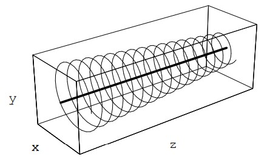
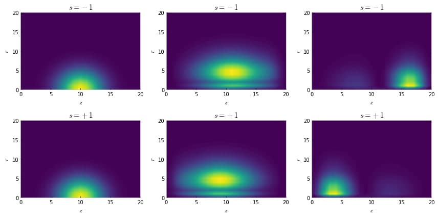
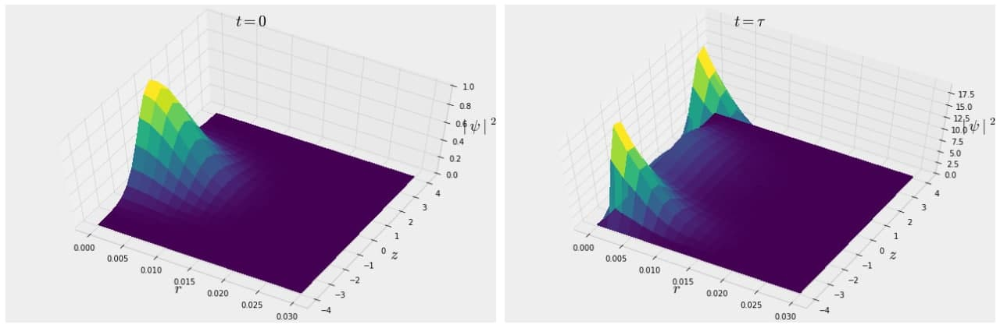

# Quantum analysis of Brillouin's Stern-Gerlach aparatus.

I present a quantum mechanical simulation of a setup that is analogous to Brillouin's idea. Brillouin noticed that if the electron beam was sent parallel to the primary field's axis rather than transverse to it, the Lorentz force's negative influence could be avoided. I want to investigate if a spin-dependent wavepacket splitting can be observed in the z direction when the solenoid is tapered to induce a field inhomogeneity in the z direction.

